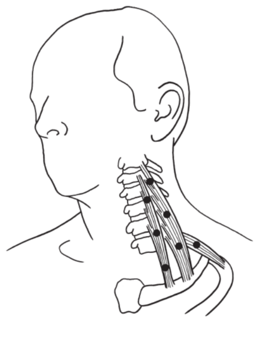

Muscle tension can cause an insane amount of symptoms in the head and neck region:  
 Blurred Vision  
 Dizziness  
 Migraine Headaches  
 Nausea  
 Visual Disturbances  

Many triggers for headaches actually cause latent trigger points to "activate". Latent trigger points are contracted muscle fibers that are not yet causing any pain or symptoms. Simply coughing, consuming nicotine, alcohol, caffeine, certain medications, nutritional defenciencies, or sugar can do the trick. If the trick was to send you to the dark headache abyss. 

These trigger points can also be set off by emotional distress, allergic reactions, chemical withdrawal, and physical trauma. 

Muscle tension in the jaw, upper back, and neck muscles are the most common causes for the symptoms above. And they are not usually located where you feel the pain and dysfunction. 

Upper back and shoulder tension causes neck pain, then your neck muscles cause headaches. 

Obviously, pain, headaches, and vertigo can have other causes besides trigger points. But up to 80-90% of our physical pain is cause by myofascial dysfunction. So it's worth starting here first. 

Here is a cute little table to help you figure out what muscle is causing your symptoms:

| Muscle Group        | Symptoms                                                                     |
| ------------------- | ---------------------------------------------------------------------------- |
| Scalenes            | numbness, tingling, weird sensations in chest, shoulder, arm, neck, and hand |
| Sternocleidomastoid | vertigo, blurred vision, dizziness, migraines, nausea, visual disturbances   |
| Splenius cervicis   | blurred vision, migraines, visual disturbances                               |
| Suboccipitals       | blurred vision, migraines, visual disturbances                               |
| Trapezius           | migraines                                                                    |
| Temporalis          | migraines                                                                    |
## Self Massage
Doing self massage is great because you can do it daily and for free. You can also use tools like [Therapy Balls](https://www.tuneupfitness.com/shop/massage-balls), lacrosse balls, or a theracane to save your hands. 

Find a sore or tense muscle, then do 10 slow strokes per spot. Work bad areas multiple times per day. Aim for a 5/10 on the "Good pain" scale. If you suddenly find yourself holding your breath, then you are pressing too hard. Breath holding signals the brain that you are in trouble and can make muscle tense up even more. 

Avoid anything that feels weird or gives you "bad pain".

### Scalenes

Tight scalenes can pull the first rib up into the collar bone and squeeze blood vessels  and nerves. Restricted bloodflow and nerve disturbance can cause pain, burning, numbness, and tingling all the way down the arm and hands (thoracic outlet syndrome).

It's worth starting here because scalenes can cause so many other muscles to also be tense.

**Common causes for tight scalenes:**  
 Poor breathing mechanics (breathing too much with accessory breathing muscles instead of diaphragm)  
 Hyperventilating   
 Heavy coughing or sneezing  
 Emotional tension  
 Working long hours with hands out in front of you  

**What you should do:**
Work on your posture, such as keeping your head center, not slouching, etc. And practice diaphragm breathing with [deadbugs](https://nick-e.com/deadbug/). Meditation, therapy, or journaling may help with emotional distress.

Massage the muscles in the front and side of the neck, being careful to avoid pulses and anything that feels weird. Do this throughout the day to relax these muscles. 

### Sternocleidomastoid 

Tension here can cause dizziness that can occur suddenly or last for minutes, hours, or days. And often given a diagnosis of vertigo.

Sternocleidomastoid muscles help with spatial orientation that helps your brain keep track of the position of your head. Confusing signals are sent to the brain when there is tension here. 

This can also cause a referred spasm in the muscle that surrounds the eye. Leading to blurry vision.

Common causes:  
 Bad head posture  
 Other trigger points or muscle imbalance  
 Whiplash  
 Using breath accessory muscles instead of diaphragm.  

### Trapezius

Headache and sore neck

Common causes:  
 slouched posture while seated  
 forward head  
 tight pecks  
 tight abs  
 working long hours with hands out in front of you   
 emotional tension that keeps your shoulders up  

Purposefully let your shoulders drop down multiple times during the day.

### Splenius cervicis
This muscle bends, flexes, and twists the neck. 

Common causes:  
 lounging with head propped at an angle 
 pulling excessive weight  
 cold exposure with relaxed breathing  
 forward-­head posture 
 whiplash

Fix underlying posture issues and [learn to relax](https://www.health.harvard.edu/staying-healthy/try-this-progressive-muscle-relaxation-for-sleep). 

### Suboccipital

Common causes:  
 whiplash  
 forward-head posture  
 emotional tension  
 postural stresses  
 worry

### Temporalis

Sources:
- https://books.google.com/books/about/Travell_Simons_Myofascial_Pain_and_Dysfu.html?id=sU0XupX7DGsC
- https://www.google.com/books/edition/The_Trigger_Point_Therapy_Workbook/DLb7ShX-gskC?hl=en&gbpv=0