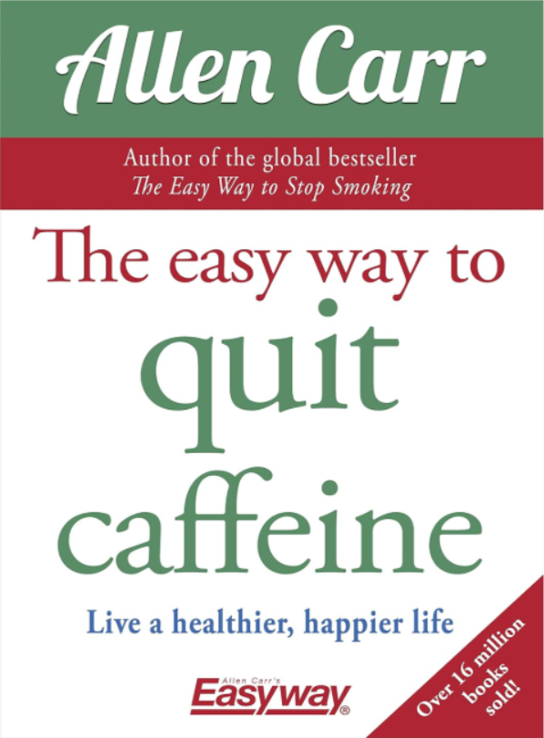

  
  

    <h3 class="mb-1">
    </h3>
    

    ★★☆☆☆
    

    

    Good information but nothing new if you've read Caffeine Blues. Other than some good pep talking. Author says withdrawals are barely noticeable with the right mindset. I have to hard disagree with this. (I will change this if I am wrong.)
    

  

# My Notes

* EASILY, IMMEDIATELY AND PERMANENTLY 
* WITHOUT FEELING DEPRIVED 
* WITHOUT USING WILLPOWER, SUBSTITUTES OR OTHER GIMMICKS 
* WITHOUT SUFFERING DEPRESSION OR WITHDRAWAL SYMPTOMS 
* WITHOUT GAINING WEIGHT

Removes the feeling that you are making a sacrifice.

The problem, we’re told, is not only the physical withdrawal but also that we need to use willpower to resist the craving.

To find it easy to quit, you must achieve a frame of mind whereby, whenever you think about any caffeinated product, you feel a sense of freedom and relief that you don’t consume it anymore.

That’s the only way to become, and remain, truly free.

START OFF IN A HAPPY FRAME OF MIND

THINK POSITIVELY

You made a decision to start consuming it based on flawed information.

Every single day for the rest of your life is a pretty big commitment to something that you don’t really need and something that costs you in terms of time, health and money.

You never chose to become – or to remain – a caffeine addict; no one chooses to poison themselves with a toxic liquid.

Telling someone to limit their intake of an addictive drug is like telling someone that they can jump off the top of a cliff as long as they don’t fall more than a few metres.

Your brain has taught your body to cope with the foul taste, so you can get the drug to which you have become addicted.

You were perfectly energetic before you started consuming caffeine.

The reality is that caffeine addiction makes you permanently tired and exhausted. Take a look at anyone with a caffeine problem. They look tired, run down, and ready to drop. The irony is that the only thing that’s stopping them returning to their energetic, athletic, vivacious former self is the one thing they think they need to function – caffeine.

The history of mankind is peppered with behaviour that, at one time, was considered normal, but is now clearly seen as bizarre or abhorrent.

We don’t get into the habit of drinking coffee and then get addicted to caffeine. It’s the other way around. We get addicted to caffeine and then get into the routine, or habit, of consuming it at regular intervals.

It’s like a little monster inside your body that feeds on caffeine. If you don’t feed it, it complains. Feed it and the feelings disappear for a while only to return as the latest dose withdraws from your body. When you break free from caffeine addiction, you’re going to starve that little monster to death.

Withdrawal makes us feel physically lethargic while mentally restless. It is distracting and therefore impairs concentration. Each dose of caffeine seems to relieve these symptoms and we are therefore fooled into believing that we get a genuine pleasure or crutch from it.

Large corporations understand only too well the addictive nature of the drug and, like sugar, they are adding it to as many of their products as they can, often justified by the ludicrous assertion that it’s just flavouring.

A 2014 study from the American Heart Association indicated that 40 per cent of the 5,156 calls to poison centres for “energy drink exposure” involved children under the age of six.

Pharmaceutical grade caffeine comes with the following message: “WARNING! MAY BE HARMFUL IF INHALED OR SWALLOWED. INHALATION CAUSES RAPID HEART RATE, EXCITEMENT, DIZZINESS, PAIN, COLLAPSE, HYPERTENSION, FEVER, SHORTNESS OF BREATH. MAY CAUSE HEADACHE, INSOMNIA, NAUSEA, VOMITING, STOMACH PAIN, COLLAPSE AND CONVULSIONS. FATALITIES HAVE BEEN KNOWN TO OCCUR.”

Cutting down or trying to control an addiction doesn’t work. It takes tremendous willpower and makes the drug appear more precious, just as dieting makes food appear more precious. You find yourself wishing your life away waiting for your next fix. In addition to that, you’re causing yourself to suffer withdrawal pangs. When you do finally indulge yourself, the relief – both physical and mental – is increased, so the illusion of pleasure is also increased and you become more psychologically addicted. Eventually your willpower runs out and you usually end up consuming even more caffeine than before.

All we are doing is consuming caffeine to feel like a non-caffeine addict – to feel how we felt before we had our first-ever shot of the drug.

Each time we experience that partial relief when we take caffeine, it reinforces the brainwashing and perpetuates the illusion that we get some kind of pleasure or benefit from it.

The lower the drug drags us down, the more grateful we are for the little boosts it seems to give us and the more dependent we feel on it.

We’re withdrawing from it even when we are consuming it because, as previously explained, it never completely relieves the slightly low physical state of emptiness and restlessness which it creates.

If you want a burst of energy, there are lots of things you can do: Listening to your favourite song can be incredibly energizing. Exercising gets your heart pumping and blood flowing. Engaging your brain with a mental task, e.g. a crossword, creates mental energy. Deep breathing. A brisk walk in the fresh air.

You remain just as tired, just as lethargic and run down as you were in the first place. If you look at people who seem to rely on caffeine to keep them going, you’ll see this is true. They don’t walk around with purpose; they’re not bursting with energy. They normally look tired, run down, lethargic and exhausted – as if they’re running on empty.

Caffeine is doing plenty TO you. What may well be news to you is that it is doing nothing FOR you.

Your “normal” is in fact the low of withdrawal, compounded by the low of your mental craving for the drug, compounded in turn by the depleted state of mind, body and spirit that every addict suffers and mistakes for normal.

The vast majority of human achievement in the arts and sciences has been fuelled not by caffeine but by genuine energy and inspiration.

These are your birthright. They are inside all of us, and far from bringing them out, caffeine will dampen them.

Caffeine withdrawal symptoms are usually mild – an empty, slightly uptight, insecure feeling. There can also be fatigue and sometimes headaches. However, the physical withdrawal is not a problem. In fact, if you’re in the right frame of mind, you can actually enjoy the purging process.

Some people report feelings of mild depression and it’s important to realize that this only occurs if you feel you’re missing out on something, if you cling to the illusion that you’re being deprived of a genuine pleasure or crutch.

Some people report feelings of mild depression and it’s important to realize that this only occurs if you feel you’re missing out on something, if you cling to the illusion that you’re being deprived of a genuine pleasure or crutch.

If you’re happy to be free and realize that there’s nothing to give up so that you’re not making any sacrifice whatsoever, then you can actually enjoy the process of escaping.

Quit caffeine for the simple reason that you’ll enjoy your life more once free of your addiction.

The problem with cutting down gradually is that it makes caffeine seem more precious rather than less.

As long as you understand that you’re not giving anything up, withdrawal from caffeine is barely noticeable.

Feeling a bit tired, anxious and having a headache isn’t that far from normal, everyday life for even the lightest caffeine addict. It’s nothing that keeping hydrated with water and, if necessary, an aspirin or another caffeine-free headache pill and a little rest won’t sort out.

There’s only one way to control your caffeine intake and that’s to stop taking it completely.

We think of tiredness and pain as evils. On the contrary, they’re red warning lights. Tiredness is your body telling you that you need to rest. Pain is telling you that part of your body is being attacked and that remedial action is necessary.

Whether the stress is real or illusory, drugs will make the reality and the illusion worse.

Addiction is not an all-powerful mystical phenomenon or a permanent illness or condition that you can never free yourself from. At its root is a simple misunderstanding. Your brain mistakes caffeine as providing relief from caffeine withdrawal rather than being the cause of it.

Approach the process of stopping not with gloom or doom but with a feeling of excitement, of relief that your addiction is behind you, and of elation that you are finally free.

Make a point of reminding yourself how lucky you are to be free and how miserable being a slave to caffeine made you.

1. Having made what you know to be the correct decision, NEVER EVER question that decision.

The difficulty in quitting lies not in the physical withdrawal pangs, but in continuing mentally to crave the drug and in questioning or doubting your decision never to take it again.

2. Don’t think, “I must never have caffeine again.” That would create a feeling of deprivation. Instead, start with the feeling, “Isn’t it great! My life is no longer affected by caffeine. I’M FREE!”

Do not – try to avoid thinking about caffeine.

3. Be aware that for the next few days there will be a little monster inside your body, wanting to be fed. The feeling might register as just a slight, empty, insecure feeling, or just the feeling of “I want some caffeine”.

You may feel a little tired or lethargic or have a headache. Either way, don’t worry about it. Remember, that is what you’ve been suffering ever since you fell into the trap and it is so slight we don’t even know it’s there most of the time.

The great news is that you know that little monster is dying. You’re starving it of caffeine. Think of it as such.

